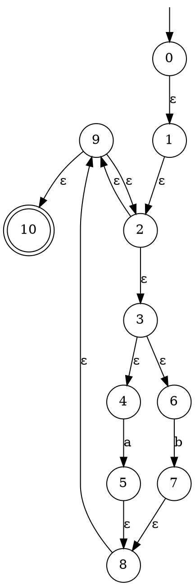
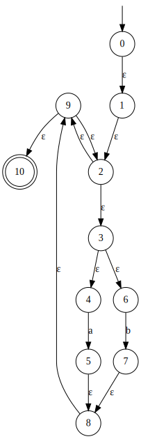
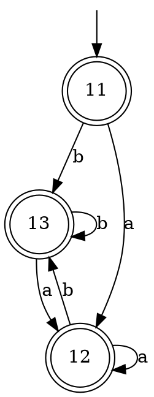
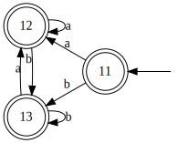

# Regex Engine
Simple Regex engine written in Java.

## Phases
1. Parse AST from regex string.
2. Construct NFA.
3. Transform NFA into DFA utilizing Thompson's construction.
4. Step through DFA char by char.

## Supported regex features
- `r?`: Optional
- `r+`: Repetition (at least once)
- `r*`: Repetition
- `(r)`: Grouping
- `rr`: Conjunction
- `r|r`: Disjunction

## Examples
- `a(b|c)+de`
- `ab?`
- `a*b(cd)+`

## Usage
`java -jar regex-engine.jar <pattern> <input>`

## GraphViz
When executed directly through CLI, [Graphviz](https://graphviz.org/) DOT code will be emitted. 
It can be used to visualize the automatons generated from the provided regex (for example using 
[this website](http://magjac.com/graphviz-visual-editor/)).
### Example
#### Regex
`(a|b)*`

#### NFA

#### DFA

